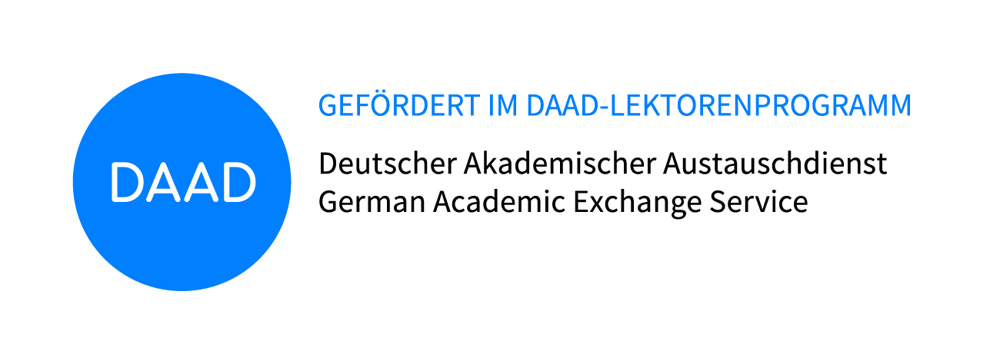

## Herzlich willkommen

> Alles, was man wissen muss, um eine Sprache zu erwerben / erlernen / vermitteln, steckt in der Sprache selbst. (Perkuhn und Belica 2006, 6)

Die moderne Sprachforschung ist längst im Computerzeitalter angekommen und hat sich *big linguistic data* verschrieben. In ihren riesigen digitalen Textsammlungen (Korpora) ist alles zu finden, was man wissen muss, um eine Sprache zu erlernen und zu vermitteln. Sie müssen diesen Sprachschatz nur durchsuchen, die Spreu vom Weizen trennen und didaktisch sinnvoll aufbereiten. Dabei lohnt ein inspirierender Blick auf die englische Fremdsprachenlehre, die Computer und Textsammlungen schon seit langem erfolgreich im Unterricht einsetzt (Boulton und Vyatkina 2021). 

In der Lehr- und Lernpraxis von Deutsch als Fremdsprache dagegen sind diese zeitgemäßen Methoden dagegen noch immer weitgehend ungenutzt.

In Germanistik Südwest (GSW) 2022 machen wir uns zusammen mit ExpertInnen aus Deutschland und China auf den Weg. GSW 2022 macht uns Lehrkräfte mit den wissenschaftlichen Grundlagen, didaktischen Vorteilen und ganz konkreten Einsatzmöglichkeiten digitaler Textsammlungen in unserer eigenen Unterrichtspraxis vertraut. In einer Kombination aus Vorträgen und Workshops lernen wir die computer-assistierten Methoden der modernen digitalen Sprachforschung kennen und erarbeiten praktische Möglichkeiten, ihre Ressourcen für unsere Sprachlehre zu nutzen.

GSW 2022 ist vollständig online. Die Arbeitssprache ist Deutsch.

##### In Kooperation mit

 

  

    
  

  

    
  

 
 

  

    

    Deutschlehrerverband Südchinas 
    西南地区德语教师联盟
    

  

 

