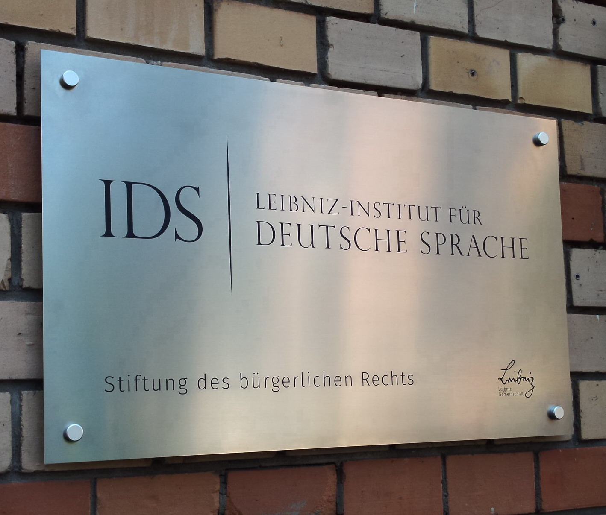
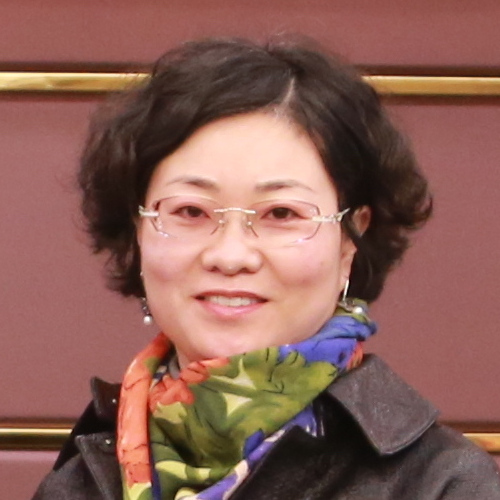
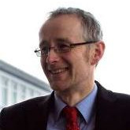

## Keynotes

### Rainer Perkuhn

  
  

    
  

  

  ... ist diplomierter Informatiker und seit 2002 wissenschaftlicher Mitarbeiter am Institut für deutsche Sprache in Mannheim. In seiner Forschungsarbeit untersucht er den Gebrauch von Wörtern in Textsammlungen, beschreibt Wortschätze und erstellt Wortlisten für unterschiedliche Themen und Zwecke. Er unterrichtet an den Universitäten Mannheim und Heidelberg und hat mehrere methodische Workshops unter anderem in Japan gegeben. In seinem Vortrag spricht er über die Grundlagen seiner Disziplin und führt uns auf praktische Weise in den Umgang mit großen digitalen Textsammlungen ein. (Foto: Annette Trabold, IDS)
  

### Li Yuan

  

    
  

  
  

  ... hat in Berlin und Shanghai Germanistik studiert und ist seit 2004 Professorin an der School of International Studies der Zhejiang-Universität in Hangzhou. Sie forscht in den Bereichen German Studies, Fremdsprachenlehre, interkulturelle Kommunikation und Medien und nutzt hierfür auch computer-gestützte Untersuchungsmethoden. Außerdem hat sie zahlreiche deutsche Werke ins Chinesische übertragen. In ihrem Vortrag spricht sie über die Digitalisierung der chinesischen Germanistik und in China nutzbare Textsammlungen und online Ressourcen. (Foto: privat)
  

### Christian Krekeler

  

    
  

  
  

  ... ist seit 2001 Professor für Deutsch als Fremd- und Fachsprache an der Hochschule Konstanz und unter anderem verantwortlicher Redakteur der Zeitschrift <i>Info DaF</i>. Seine Arbeitsschwerpunkte liegen in den Bereichen Fachsprachen-Didaktik, Schreiben in der Fremdsprache und Sprachtests. Außerdem erforscht er Möglichkeiten, digitale Textsammlungen für den fachsprachlichen Unterricht und in der Schreibberatung einzusetzen. In seinem Vortrag erläutert er den Einsatz von Textsammlungen am Beispiel einer Unterrichtseinheit für den Wirtschaftsdeutsch-Unterricht. (Foto: privat)
  

## Workshops

### Workshop 1

Dieser Workshop schließt an die Vorträge von Rainer Perkuhn und Li Yuan an. Die Teilnehmenden diskutieren die Relevanz der wissenschaftlichen Begriffe für die Sprachlehre und den didaktischen Wert entsprechender Ressourcen. Als ein Beispiel für den praktischen Einsatz von Textsammlungen im Unterricht werden Übungen aus dem Projekt *Incorporating Corpora* (Vyatkina 2020) für die Vermittlung grammatischer Strukturen besprochen. Anschließend erarbeiten die Teilnehmenden eigene Übungen mit einfach nutzbaren online Tools wie dem *DWDS* oder dem *Leipziger Wortschatzportal* (Quasthoff und Richter 2005). 

Sabrina Stock (DAAD, Chongqing), Yang Yaqing (SISU, Chongqing), Daniel Jach (DAAD, Chengdu)  

### Workshop 2

In diesem Workshop knüpfen die Teilnehmenden an den Vortrag von Christian Krekeler über Fachsprachen-Unterricht an. Sie diskutieren Möglichkeiten für den Einsatz von Textsammlungen in fachsprachlichem Unterricht wie zum Beispiel Wirtschaftsdeutsch, Wissenschaftliches Schreiben oder Deutsch für Techniker und erstellen dann eine eigene fachsprachliche Textsammlung. Die Teilnehmenden erlernen den Umgang mit dem Computerprogramm *AntConc* (Anthony 2022) und erarbeiten Lernaktivitäten für den eigenen Unterricht. Außerdem werden geeignete Prüfungsformen diskutiert und entwickelt. 

<<<<<<< HEAD
Christoph Gube (DAAD, Tianjin), Daniel Jach (DAAD, Chengdu)

### Workshop 3

Nach zwei fachlichen Workshops zum Thema *Textsammlungen* sorgt der letzte Workshop für inhaltliche Abwechslung. In einem interaktiven online Beitrag lernen die Teilnehmenden das neu bearbeitete Lehrwerk *Netzwerk neu A1* von Klett/FLTRP kennen und üben den Einsatz im Unterricht mit exklusivem Probeimages. Die Teilnehmenden haben außerdem Gelegenheit zum Erfahrungsaustausch mit einer erfahrenen Lehrkraft und imagesentwicklern. 

Bastian Czura (Goethe-Institut, Taipei), Jennifer Swanda (Klett-Verlag, Stuttgart)
=======
### Workshop 3

Nach zwei fachlichen Workshops zum Thema *Textsammlungen* sorgt der letzte Workshop für inhaltliche Abwechslung. In einem interaktiven online Beitrag lernen die Teilnehmenden das neu bearbeitete Lehrwerk *Netzwerk neu A1* von Klett/FLTRP kennen und üben den Einsatz im Unterricht mit exklusivem Probematerial. Die Teilnehmenden haben außerdem Gelegenheit zum Erfahrungsaustausch mit einer erfahrenen Lehrkraft und Materialentwicklern. 

Referent Name (Taipei), Jennifer Swanda (Stuttgart)
>>>>>>> 3d0ee1fb0a30c464077aaf56940432ce8ad40160
